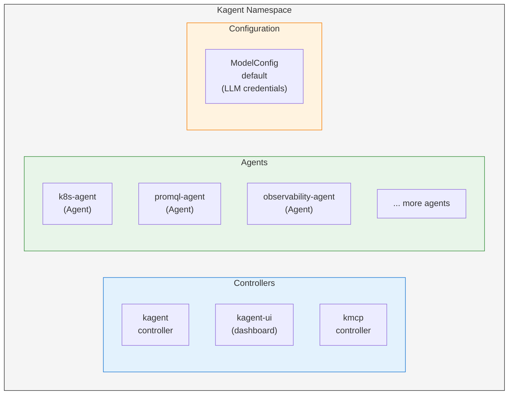

# Chapter 2: Deploy Kagent & MCP

In this chapter, you'll deploy [Kagent](https://kagent.dev/) - a Kubernetes-native framework for building AI agents - along with the kmcp controller for managing MCP (Model Context Protocol) servers.

## Goals

- Configure Pulumi ESC with stack reference for kubeconfig
- Deploy Kagent CRDs and controller via Helm
- Deploy kmcp for MCP server management
- Configure the LLM provider (DigitalOcean GenAI)
- Access the Kagent dashboard via LoadBalancer
- Explore the built-in K8s and PromQL agents

## Estimated Time: 45 minutes

---

## What is Kagent?

Kagent is a CNCF sandbox project that brings agentic AI to Kubernetes. It provides Custom Resource Definitions (CRDs) for defining agents declaratively, built-in agents for Kubernetes operations (k8s-agent, promql-agent, observability-agent), MCP integration for connecting to external tools and services, and a web UI for interacting with agents via chat.

## Step 1: Create the Workload ESC Environment

**Important**: For deploying workloads to Kubernetes, we use a **separate ESC environment** from the infrastructure one. This environment uses Pulumi ESC's stack reference feature to automatically retrieve the kubeconfig from the Chapter 1 stack output.

### Why Separate Environments?

- **Infrastructure environment** (`workshop`): Contains cloud provider credentials (DO token) for creating infrastructure
- **Workload environment** (`workload`): Contains kubeconfig (via stack reference) and application credentials (LLM API keys)

Both environments live in the same ESC project (`cfgmgmtcamp-2026-workshop-infra-env`). This separation follows the principle of least privilege - workload deployments don't need cloud provider credentials.

### Create the Workload ESC Environment

1. Navigate to [Pulumi Cloud](https://app.pulumi.com) and select your organization

2. Go to **Environments** in the left sidebar and click **Create environment**

3. Select the existing ESC project `cfgmgmtcamp-2026-workshop-infra-env` and name the environment `workload`, then click **Create**. This creates the path `cfgmgmtcamp-2026-workshop-infra-env/workload`

4. In the environment editor, add the following YAML configuration:

```yaml
values:
  # Get kubeconfig from Chapter 1 stack using stack reference
  # This enables automatic connection to the K8s cluster created in Chapter 1
  stacks:
    fn::open::pulumi-stacks:
      stacks:
        k8s-cluster:
          stack: cfgmgmtcamp-2026-agentic-ai-workshop/dev

  kubeconfig: ${stacks.k8s-cluster.kubeconfig}

  # DigitalOcean GenAI Configuration
  llm:
    endpoint: "https://inference.do-ai.run/v1"
    model: "anthropic-claude-opus-4.5"
    apiKey:
      fn::secret: "your-do-genai-api-key-here"

  # Pulumi configuration values
  pulumiConfig:
    llmEndpoint: ${llm.endpoint}
    llmModel: ${llm.model}
    llmApiKey: ${llm.apiKey}
    kubernetes:kubeconfig: ${kubeconfig}

  # Environment variables
  environmentVariables:
    OPENAI_API_BASE: ${llm.endpoint}
    OPENAI_API_KEY: ${llm.apiKey}
    LLM_MODEL: ${llm.model}

  # Kubeconfig as file
  files:
    KUBECONFIG: ${kubeconfig}
```

5. Replace `your-do-genai-api-key-here` with your actual DigitalOcean GenAI API key

6. Click **Save** to save the environment

The key feature is the `pulumi-stacks` provider which retrieves the `kubeconfig` output from your Chapter 1 stack automatically.

## Step 2: Create the Project Directory

Create a new directory for this chapter's code:

```bash
mkdir -p cfgmgmtcamp-2026-kagent
cd cfgmgmtcamp-2026-kagent
pulumi new typescript -f
```

Install the Kubernetes provider:

```bash
npm install @pulumi/kubernetes
```

## Step 3: Write the Pulumi Program

Open `index.ts` and replace the contents with the following code to deploy Kagent and kmcp:

```typescript
import * as k8s from "@pulumi/kubernetes";
import * as pulumi from "@pulumi/pulumi";

// Configuration
const config = new pulumi.Config();
const llmApiKey = config.requireSecret("llmApiKey");
const llmEndpoint = config.get("llmEndpoint") || "https://inference.do-ai.run/v1";
const llmModel = config.get("llmModel") || "anthropic-claude-opus-4.5";

// Create kagent namespace
const kagentNs = new k8s.core.v1.Namespace("kagent", {
    metadata: { name: "kagent" },
});

// Create secret for LLM API key (must exist before kagent helm release)
// The secret name must match apiKeySecretRef and key must match apiKeySecretKey
const llmSecret = new k8s.core.v1.Secret("kagent-openai", {
    metadata: {
        name: "kagent-openai",
        namespace: kagentNs.metadata.name,
    },
    stringData: {
        "OPENAI_API_KEY": llmApiKey,
    },
}, { dependsOn: [kagentNs] });

// Install Kagent CRDs (includes kmcp-crds as dependency)
const kagentCrds = new k8s.helm.v3.Release("kagent-crds", {
    chart: "oci://ghcr.io/kagent-dev/kagent/helm/kagent-crds",
    namespace: kagentNs.metadata.name,
    version: "0.7.12",
    values: {
        kmcp: {
            enabled: true,
        },
    },
}, { dependsOn: [kagentNs] });

// Install Kagent with DigitalOcean GenAI as OpenAI-compatible provider
// Note: kagent chart includes kmcp as a dependency when kmcp.enabled is true
const kagent = new k8s.helm.v3.Release("kagent", {
    chart: "oci://ghcr.io/kagent-dev/kagent/helm/kagent",
    namespace: kagentNs.metadata.name,
    version: "0.7.12",
    values: {
        // Use consistent naming (agents expect "kagent-controller" service name)
        fullnameOverride: "kagent",
        // Controller configuration - increase A2A streaming timeout for long-running tasks
        // Default is 600s (10 min), increase to 1200s (20 min) for Pulumi Neo operations
        controller: {
            streaming: {
                timeout: "1200s",
            },
        },
        // Configure the model provider
        providers: {
            default: "openAI",
            openAI: {
                provider: "OpenAI",
                model: llmModel,
                apiKeySecretRef: "kagent-openai",
                apiKeySecretKey: "OPENAI_API_KEY",
                config: {
                    baseUrl: llmEndpoint,
                    maxTokens: 4096,  // Required for Anthropic models via OpenAI-compatible endpoints
                },
            },
        },
        // UI configuration
        ui: {
            enabled: true,
            service: {
                type: "LoadBalancer",
                ports: {
                    port: 8080,
                },
            },
        },
        // Enable kmcp (included as subchart dependency)
        kmcp: {
            enabled: true,
        },
        // Enable built-in agents
        agents: {
            "k8s-agent": { enabled: true },
            "promql-agent": { enabled: true },
            "observability-agent": { enabled: true },
        },
        // Configure grafana-mcp with consistent naming (for observability-agent)
        "grafana-mcp": {
            fullnameOverride: "kagent-grafana-mcp",
            grafana: {
                url: "http://kube-prometheus-stack-grafana.monitoring:80",
            },
        },
    },
}, { dependsOn: [kagentCrds, llmSecret] });

// Export the namespace
export const namespace = kagentNs.metadata.name;

// Export status of Helm releases
export const kagentVersion = "0.7.12";
export const kagentReleaseName = kagent.name;
```

<details markdown="1">
<summary>Click to see YAML version</summary>

```yaml
name: 02-kagent-mcp
runtime: yaml
description: Deploy Kagent and kmcp to Kubernetes cluster

config:
  llmApiKey:
    type: string
    secret: true
  llmEndpoint:
    type: string
    default: "https://inference.do-ai.run/v1"
  llmModel:
    type: string
    default: "anthropic-claude-opus-4.5"

resources:
  # Create kagent namespace
  kagent-ns:
    type: kubernetes:core/v1:Namespace
    properties:
      metadata:
        name: kagent

  # Create secret for LLM API key (must exist before kagent helm release)
  # The secret name must match apiKeySecretRef and key must match apiKeySecretKey
  kagent-openai:
    type: kubernetes:core/v1:Secret
    properties:
      metadata:
        name: kagent-openai
        namespace: ${kagent-ns.metadata.name}
      stringData:
        OPENAI_API_KEY: ${llmApiKey}
    options:
      dependsOn:
        - ${kagent-ns}

  # Install Kagent CRDs (includes kmcp-crds as dependency)
  kagent-crds:
    type: kubernetes:helm.sh/v3:Release
    properties:
      chart: oci://ghcr.io/kagent-dev/kagent/helm/kagent-crds
      namespace: ${kagent-ns.metadata.name}
      version: "0.7.12"
      values:
        kmcp:
          enabled: true
    options:
      dependsOn:
        - ${kagent-ns}

  # Install Kagent with DigitalOcean GenAI as OpenAI-compatible provider
  # Note: kagent chart includes kmcp as a dependency when kmcp.enabled is true
  kagent:
    type: kubernetes:helm.sh/v3:Release
    properties:
      chart: oci://ghcr.io/kagent-dev/kagent/helm/kagent
      namespace: ${kagent-ns.metadata.name}
      version: "0.7.12"
      values:
        # Use consistent naming (agents expect "kagent-controller" service name)
        fullnameOverride: kagent
        # Controller configuration - increase A2A streaming timeout for long-running tasks
        # Default is 600s (10 min), increase to 1200s (20 min) for Pulumi Neo operations
        controller:
          streaming:
            timeout: "1200s"
        # Configure the model provider
        providers:
          default: openAI
          openAI:
            provider: OpenAI
            model: ${llmModel}
            apiKeySecretRef: kagent-openai
            apiKeySecretKey: OPENAI_API_KEY
            config:
              baseUrl: ${llmEndpoint}
              maxTokens: 4096  # Required for Anthropic models via OpenAI-compatible endpoints
        # UI configuration
        ui:
          enabled: true
          service:
            type: LoadBalancer
            ports:
              port: 8080
        # Enable kmcp (included as subchart dependency)
        kmcp:
          enabled: true
        # Enable built-in agents
        agents:
          k8s-agent:
            enabled: true
          promql-agent:
            enabled: true
          observability-agent:
            enabled: true
        # Configure grafana-mcp with consistent naming (for observability-agent)
        grafana-mcp:
          fullnameOverride: kagent-grafana-mcp
          grafana:
            url: "http://kube-prometheus-stack-grafana.monitoring:80"
    options:
      dependsOn:
        - ${kagent-crds}
        - ${kagent-openai}

outputs:
  namespace: ${kagent-ns.metadata.name}
  kagentVersion: "0.7.12"
  kagentReleaseName: ${kagent.name}
```
</details>

## Step 4: Configure the Stack

Create `Pulumi.dev.yaml` in your project directory to import your workload ESC environment:

```yaml
environment:
  - cfgmgmtcamp-2026-workshop-infra-env/workload
```

The workload ESC environment provides:
- `kubernetes:kubeconfig` - Automatically connects to your Chapter 1 cluster (via stack reference)
- `llmApiKey` - LLM API key for Kagent
- `llmEndpoint` - DigitalOcean GenAI endpoint
- `llmModel` - The LLM model to use

## Step 5: Deploy Kagent

Run `pulumi up` to deploy:

```bash
pulumi up
```

This will install:
- Kagent CRDs (Agent, ModelConfig, ToolServer, RemoteMCPServer)
- kmcp CRDs (automatically via kagent-crds subchart)
- Kagent controller and UI
- kmcp controller (automatically via kagent subchart)
- Built-in k8s-agent, promql-agent, and observability-agent

## Step 6: Get the Dashboard URL

**Note**: Since your kubeconfig is stored in the ESC environment, use `pulumi env run` to execute kubectl commands:

Wait for the LoadBalancer to be assigned an external IP:

```bash
pulumi env run cfgmgmtcamp-2026-workshop-infra-env/workload -- kubectl get svc -n kagent -w
```

Press **Ctrl+C** once you see an external IP assigned.

Get the dashboard URL:

```bash
KAGENT_IP=$(pulumi env run cfgmgmtcamp-2026-workshop-infra-env/workload -- kubectl get svc kagent-ui -n kagent -o jsonpath='{.status.loadBalancer.ingress[0].ip}')
echo "Dashboard URL: http://$KAGENT_IP:8080"
```

## Step 7: Explore the Dashboard

Open the Kagent dashboard in your browser. You should see:

1. **Agents List**: k8s-agent, promql-agent, and observability-agent are available
2. **Chat Interface**: Select an agent to start chatting
3. **Tools**: Each agent has access to specific tools

### Try the K8s Agent

1. Select **k8s-agent** from the sidebar
2. Ask: "What pods are running in the kube-system namespace?"
3. Watch as it uses kubectl tools to query the cluster

### Try the PromQL Agent

1. Select **promql-agent** from the sidebar
2. Ask: "Generate a PromQL query to show CPU usage across all nodes"

**Note**: The promql-agent generates PromQL queries from natural language descriptions but doesn't execute them.

### Try the Observability Agent

1. Select **observability-agent** from the sidebar
2. Ask: "What is the CPU usage of pods in the kube-system namespace?"

**Note**: The observability-agent can execute queries against Prometheus and return real metrics. It requires Prometheus and Grafana to be deployed (we'll do this in Chapter 3). Until then, the agent will show as `READY: Unknown`.

## Step 8: Verify the Installation

Check that all components are running:

```bash
# Check Kagent pods
pulumi env run cfgmgmtcamp-2026-workshop-infra-env/workload -- kubectl get pods -n kagent

# Check CRDs
pulumi env run cfgmgmtcamp-2026-workshop-infra-env/workload -- kubectl get crds | grep kagent

# Check agents
pulumi env run cfgmgmtcamp-2026-workshop-infra-env/workload -- kubectl get agents -n kagent
```

## Checkpoint

Before proceeding, verify:

- [ ] All pods in `kagent` namespace are Running
- [ ] Dashboard is accessible via LoadBalancer IP
- [ ] k8s-agent responds to queries in the chat
- [ ] `pulumi env run ... -- kubectl get agents -n kagent` shows k8s-agent, promql-agent, and observability-agent

## Understanding the Architecture



## Stretch Goals

1. **Explore Agent CRDs**: Run `pulumi env run cfgmgmtcamp-2026-workshop-infra-env/workload -- kubectl describe agent k8s-agent -n kagent` to see the full agent specification
2. **Check Model Config**: Run `pulumi env run cfgmgmtcamp-2026-workshop-infra-env/workload -- kubectl get modelconfig -n kagent` to see the LLM configuration
3. **Test Different Prompts**: Try complex Kubernetes queries with the k8s-agent

## Learn More

- [Kagent Documentation](https://kagent.dev/docs/)
- [Model Context Protocol](https://modelcontextprotocol.io/)
- [Pulumi Kubernetes Provider](https://www.pulumi.com/registry/packages/kubernetes/)
- [Pulumi ESC Stack References](https://www.pulumi.com/docs/esc/integrations/infrastructure/pulumi-iac/pulumi-stacks/)

---

**Next**: [Chapter 3: Deploy Platform Workload](03-deploy-platform-workload)
