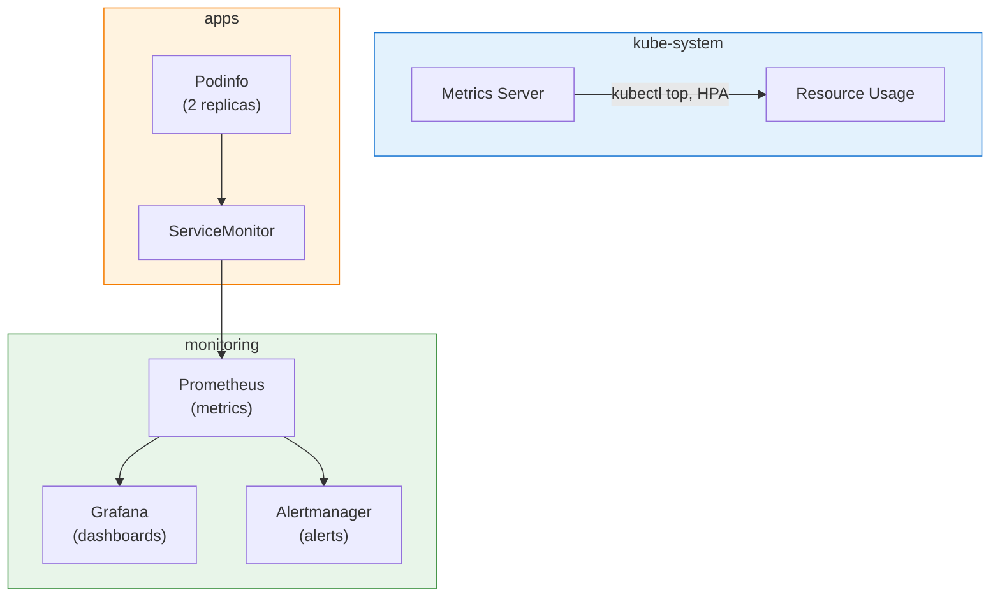

# Chapter 3: Deploy Platform Workload

In this chapter, you'll deploy the monitoring stack that our AI agents will use to analyze the cluster. This includes Prometheus for metrics collection, Grafana for visualization, and a sample application (Podinfo) for testing.

## Goals

- Deploy Metrics Server for resource metrics
- Deploy kube-prometheus-stack (Prometheus + Grafana + Alertmanager)
- Deploy Podinfo as a sample application with metrics
- Enable the observability-agent to query metrics

## Estimated Time: 30 minutes

---

## Why do we need monitoring?

Our AI agents need data to make informed decisions:

- **k8s-agent** queries the Kubernetes API for pod status, events, and configurations
- **observability-agent** queries Prometheus for metrics like CPU, memory, and application performance

Without Prometheus, the observability-agent has no data source to query!

## Step 1: Create the Project Directory

Create a new directory for this chapter's code:

```bash
mkdir -p cfgmgmtcamp-2026-platform
cd cfgmgmtcamp-2026-platform
pulumi new typescript -f
```

Install the Kubernetes provider:

```bash
npm install @pulumi/kubernetes
```

## Step 2: Write the Pulumi Program

Open `index.ts` and replace the contents with the following code to deploy the monitoring stack:

```typescript
import * as k8s from "@pulumi/kubernetes";
import * as pulumi from "@pulumi/pulumi";

// Configuration
const config = new pulumi.Config();
const grafanaAdminPassword = config.getSecret("grafanaAdminPassword") || pulumi.secret("workshop-admin");

// Create monitoring namespace
const monitoringNs = new k8s.core.v1.Namespace("monitoring", {
    metadata: { name: "monitoring" },
});

// Create apps namespace for sample application
const appsNs = new k8s.core.v1.Namespace("apps", {
    metadata: { name: "apps" },
});

// Install Metrics Server (required for kubectl top and HPA)
const metricsServer = new k8s.helm.v3.Release("metrics-server", {
    chart: "metrics-server",
    repositoryOpts: {
        repo: "https://kubernetes-sigs.github.io/metrics-server/",
    },
    namespace: "kube-system",
    version: "3.13.0",
    values: {
        args: [
            "--kubelet-insecure-tls",
        ],
    },
});

// Install kube-prometheus-stack (Prometheus, Grafana, Alertmanager)
const prometheusStack = new k8s.helm.v3.Release("kube-prometheus-stack", {
    name: "kube-prometheus-stack", // Explicit release name for consistent service names
    chart: "kube-prometheus-stack",
    repositoryOpts: {
        repo: "https://prometheus-community.github.io/helm-charts",
    },
    namespace: monitoringNs.metadata.name,
    version: "81.4.2",
    values: {
        grafana: {
            enabled: true,
            adminPassword: grafanaAdminPassword,
            service: {
                type: "LoadBalancer",
                port: 80,
            },
            // Disable init container that blocks startup
            sidecar: {
                datasources: {
                    enabled: true,
                    initDatasources: false,
                },
            },
            "grafana.ini": {
                // Enable anonymous access for observability-agent
                "auth.anonymous": {
                    enabled: true,
                    org_role: "Viewer",
                },
            },
        },
        prometheus: {
            prometheusSpec: {
                retention: "24h",
                serviceMonitorSelectorNilUsesHelmValues: false,
                podMonitorSelectorNilUsesHelmValues: false,
            },
        },
        alertmanager: { enabled: true },
        // Disable components not available in managed K8s
        kubeEtcd: { enabled: false },
        kubeControllerManager: { enabled: false },
        kubeScheduler: { enabled: false },
        kubeProxy: { enabled: false },
    },
}, { dependsOn: [monitoringNs] });

// Deploy Podinfo as sample application
const podinfo = new k8s.helm.v3.Release("podinfo", {
    chart: "podinfo",
    repositoryOpts: {
        repo: "https://stefanprodan.github.io/podinfo",
    },
    namespace: appsNs.metadata.name,
    version: "6.9.4",
    values: {
        replicaCount: 2,
        serviceMonitor: {
            enabled: true,
            interval: "15s",
        },
    },
}, { dependsOn: [appsNs, prometheusStack] });

// Exports
export const monitoringNamespace = monitoringNs.metadata.name;
export const appsNamespace = appsNs.metadata.name;
```

<details markdown="1">
<summary>Click to see YAML version</summary>

```yaml
name: 03-platform-workload
runtime: yaml
description: Deploy monitoring stack and sample application

config:
  grafanaAdminPassword:
    type: string
    secret: true
    default: workshop-admin

resources:
  monitoring-ns:
    type: kubernetes:core/v1:Namespace
    properties:
      metadata:
        name: monitoring

  apps-ns:
    type: kubernetes:core/v1:Namespace
    properties:
      metadata:
        name: apps

  metrics-server:
    type: kubernetes:helm.sh/v3:Release
    properties:
      chart: metrics-server
      repositoryOpts:
        repo: https://kubernetes-sigs.github.io/metrics-server/
      namespace: kube-system
      version: "3.13.0"
      values:
        args:
          - --kubelet-insecure-tls

  kube-prometheus-stack:
    type: kubernetes:helm.sh/v3:Release
    properties:
      name: kube-prometheus-stack  # Explicit release name for consistent service names
      chart: kube-prometheus-stack
      repositoryOpts:
        repo: https://prometheus-community.github.io/helm-charts
      namespace: ${monitoring-ns.metadata.name}
      version: "81.4.2"
      values:
        grafana:
          enabled: true
          adminPassword: ${grafanaAdminPassword}
          service:
            type: LoadBalancer
            port: 80
          sidecar:
            datasources:
              enabled: true
              initDatasources: false
          grafana.ini:
            auth.anonymous:
              enabled: true
              org_role: Viewer
        prometheus:
          prometheusSpec:
            retention: 24h
            serviceMonitorSelectorNilUsesHelmValues: false
            podMonitorSelectorNilUsesHelmValues: false
        alertmanager:
          enabled: true
        kubeEtcd:
          enabled: false
        kubeControllerManager:
          enabled: false
        kubeScheduler:
          enabled: false
        kubeProxy:
          enabled: false
    options:
      dependsOn:
        - ${monitoring-ns}

  podinfo:
    type: kubernetes:helm.sh/v3:Release
    properties:
      chart: podinfo
      repositoryOpts:
        repo: https://stefanprodan.github.io/podinfo
      namespace: ${apps-ns.metadata.name}
      version: "6.9.4"
      values:
        replicaCount: 2
        serviceMonitor:
          enabled: true
          interval: 15s
    options:
      dependsOn:
        - ${apps-ns}
        - ${kube-prometheus-stack}

outputs:
  monitoringNamespace: ${monitoring-ns.metadata.name}
  appsNamespace: ${apps-ns.metadata.name}
```
</details>

## Step 3: Configure the Stack

Create `Pulumi.dev.yaml` in your project directory to import the workload ESC environment:

```yaml
environment:
  - cfgmgmtcamp-2026-workshop-infra-env/workload
```

This reuses the same ESC environment from Chapter 2, which provides:
- `kubernetes:kubeconfig` - Automatically connects to your cluster
- `grafanaAdminPassword` - Grafana admin password (defaults to `workshop-admin`)

## Step 4: Deploy the Stack

Run `pulumi up` to deploy:

```bash
pulumi up
```

**Warning**: This deployment takes 3-5 minutes as it installs several Helm charts.

## Step 5: Verify the Deployment

Check that all pods are running:

```bash
# Check monitoring stack
pulumi env run cfgmgmtcamp-2026-workshop-infra-env/workload -- kubectl get pods -n monitoring

# Check metrics server
pulumi env run cfgmgmtcamp-2026-workshop-infra-env/workload -- kubectl get pods -n kube-system | grep metrics

# Check sample application
pulumi env run cfgmgmtcamp-2026-workshop-infra-env/workload -- kubectl get pods -n apps
```

## Step 6: Access Grafana

Get the Grafana LoadBalancer IP:

```bash
GRAFANA_IP=$(pulumi env run cfgmgmtcamp-2026-workshop-infra-env/workload -- kubectl get svc -n monitoring kube-prometheus-stack-grafana -o jsonpath='{.status.loadBalancer.ingress[0].ip}')
echo "Grafana URL: http://$GRAFANA_IP"
```

Login credentials:
- **Username**: admin
- **Password**: workshop-admin (or your configured password)

## Step 7: Test Metrics Server

Verify that `kubectl top` works:

```bash
# View node resource usage
pulumi env run cfgmgmtcamp-2026-workshop-infra-env/workload -- kubectl top nodes

# View pod resource usage
pulumi env run cfgmgmtcamp-2026-workshop-infra-env/workload -- kubectl top pods -n apps
```

## Step 8: Test the Observability Agent

Now that Prometheus is running, the observability-agent can query real metrics.

1. Open the Kagent dashboard (from Chapter 2)
2. Select **observability-agent**
3. Try these prompts:
   - "What is the CPU usage of pods in the apps namespace?"
   - "Show me memory usage for the podinfo deployment"
   - "Which nodes have the highest CPU utilization and should I be concerned?"

The observability-agent will generate PromQL queries, execute them against Prometheus, and return actual metric data.

## Step 9: Explore Prometheus (Optional)

To access the Prometheus UI directly, you can port-forward:

```bash
pulumi env run cfgmgmtcamp-2026-workshop-infra-env/workload -- kubectl port-forward -n monitoring svc/kube-prometheus-stack-prometheus 9090:9090
```

Open http://localhost:9090 to access the Prometheus UI and try queries like:

```promql
# Container CPU usage in apps namespace
rate(container_cpu_usage_seconds_total{namespace="apps"}[5m])

# Container memory usage in apps namespace
container_memory_working_set_bytes{namespace="apps"}

# Podinfo HTTP requests by status code
sum(rate(http_requests_total{namespace="apps"}[5m])) by (status)
```

**Tip**: You can also explore metrics through Grafana's "Explore" feature, which doesn't require port-forwarding.

## Architecture Overview



## Checkpoint

Before proceeding, verify:

- [ ] All pods in `monitoring` namespace are Running
- [ ] Metrics Server is running in `kube-system`
- [ ] Podinfo is running with 2 replicas in `apps`
- [ ] `pulumi env run ... -- kubectl top nodes` shows resource usage
- [ ] observability-agent can answer questions about metrics

## Stretch Goals

1. **Create a Custom Dashboard**: Import or create a Grafana dashboard for Podinfo metrics
2. **Test Alerting**: Check the Alertmanager UI for any firing alerts
3. **Explore ServiceMonitor**: Run `pulumi env run cfgmgmtcamp-2026-workshop-infra-env/workload -- kubectl get servicemonitor -A` to see how Prometheus discovers metrics

## Learn More

- [kube-prometheus-stack](https://github.com/prometheus-community/helm-charts/tree/main/charts/kube-prometheus-stack)
- [Prometheus Documentation](https://prometheus.io/docs/)
- [Grafana Documentation](https://grafana.com/docs/)
- [Metrics Server](https://github.com/kubernetes-sigs/metrics-server)

---

**Next**: [Chapter 4: Multi-Agent Troubleshooting](04-multi-agent-troubleshooting)
