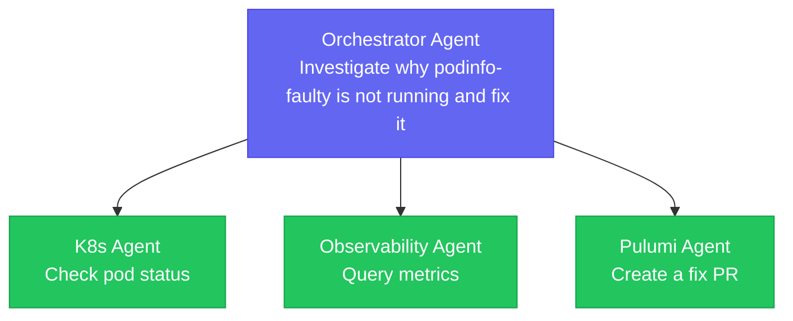
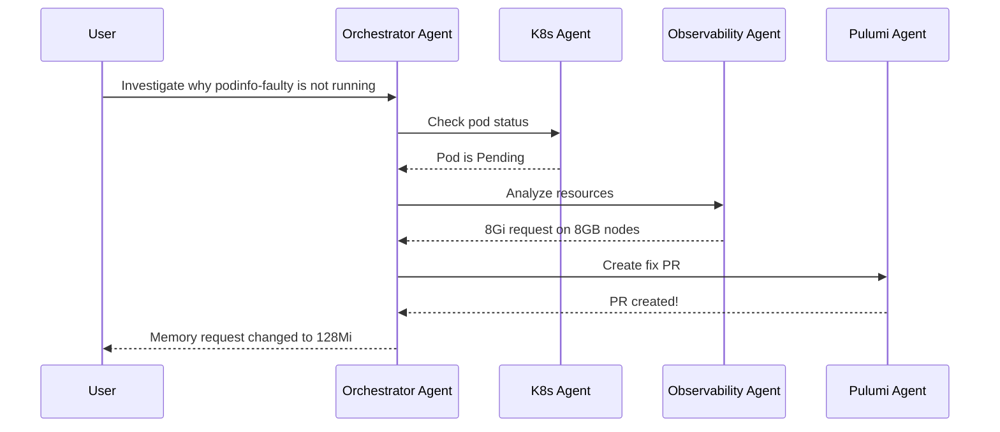

# Chapter 4: Multi-Agent Troubleshooting

This is the grand finale! In this chapter, you'll create a multi-agent system where an **orchestrator agent** coordinates specialist agents to autonomously investigate and fix infrastructure issues.

## Goals

- Deploy the Pulumi Remote MCP server integration
- Create a Pulumi Agent that can fix infrastructure code
- Create an Orchestrator Agent that coordinates other agents
- Deploy a faulty workload and watch the agents fix it!

## Estimated Time: 60 minutes

---

## The Multi-Agent Architecture



## How A2A (Agent-to-Agent) Works

Kagent supports the **Agent-as-Tool** pattern where agents can delegate work to other agents:

1. Each agent exposes **skills** via `a2aConfig`
2. Other agents can reference agents as **tools**
3. The orchestrator decides which agent to call based on the task

```yaml
# Agent A can call Agent B
tools:
- type: Agent
  agent:
    ref: agent-b  # Reference by name
```

## Step 1: Update the ESC Environment

Before we can use Pulumi Neo to create fix PRs, we need to add a Pulumi access token to our ESC environment.

1. Get a Pulumi access token from: https://app.pulumi.com/account/tokens

2. Edit your `cfgmgmtcamp-2026-workshop-infra-env/workload` environment in [Pulumi Cloud](https://app.pulumi.com) and add:

```yaml
values:
  # ... existing values (stacks, kubeconfig, llm, grafana) ...

  # Pulumi access token for Neo MCP
  pulumi:
    accessToken:
      fn::secret: "your-pulumi-access-token-here"

  pulumiConfig:
    # ... existing config ...
    pulumiAccessToken: ${pulumi.accessToken}
```

3. Click **Save** to save the environment

## Step 2: Create the Project Directory

Create a new directory for this chapter's code:

```bash
mkdir -p cfgmgmtcamp-2026-multi-agent
cd cfgmgmtcamp-2026-multi-agent
pulumi new typescript -f
```

Install the Kubernetes provider:

```bash
npm install @pulumi/kubernetes
```

## Step 3: Write the Pulumi Program

Open `index.ts` and replace the contents with the following code:

```typescript
import * as k8s from "@pulumi/kubernetes";
import * as pulumi from "@pulumi/pulumi";

// Configuration
const config = new pulumi.Config();
const pulumiAccessToken = config.requireSecret("pulumiAccessToken");

// Namespaces (assumed to exist from previous chapters)
const kagentNamespace = "kagent";
const appsNamespace = "apps";

// Create secret for Pulumi access token
const pulumiSecret = new k8s.core.v1.Secret("pulumi-access-token", {
    metadata: {
        name: "pulumi-access-token",
        namespace: kagentNamespace,
    },
    stringData: {
        token: pulumiAccessToken,
    },
});

// RemoteMCPServer for Pulumi Neo
const pulumiMcp = new k8s.apiextensions.CustomResource("pulumi-remote-mcp", {
    apiVersion: "kagent.dev/v1alpha1",
    kind: "RemoteMCPServer",
    metadata: {
        name: "pulumi-remote-mcp",
        namespace: kagentNamespace,
    },
    spec: {
        url: "https://mcp.ai.pulumi.com/mcp",
        description: "Pulumi Remote MCP for infrastructure management and Pulumi Neo",
        protocol: "STREAMABLE_HTTP",
        headersFrom: [{
            secretKeyRef: {
                name: "pulumi-access-token",
                key: "token",
            },
            header: "Authorization",
            valueTemplate: "Bearer {{ .Value }}",
        }],
    },
}, { dependsOn: [pulumiSecret] });

// Pulumi Agent with A2A skills
const pulumiAgent = new k8s.apiextensions.CustomResource("pulumi-agent", {
    apiVersion: "kagent.dev/v1alpha2",
    kind: "Agent",
    metadata: {
        name: "pulumi-agent",
        namespace: kagentNamespace,
    },
    spec: {
        description: "Infrastructure management agent using Pulumi Neo",
        type: "Declarative",
        declarative: {
            systemMessage: `You are a Pulumi infrastructure expert. Your role is to:
- Analyze infrastructure code and configurations
- Use Pulumi Neo to understand existing infrastructure
- Create pull requests with fixes for infrastructure issues
- Implement infrastructure changes safely following GitOps practices

When asked to fix issues:
1. First analyze the current state using Pulumi Neo tools
2. Identify the root cause in the Pulumi code
3. Create a PR with the fix using Neo's PR creation capability
4. Explain what changes were made and why`,
            modelConfig: "default",
            tools: [{
                type: "McpServer",
                mcpServer: {
                    name: "pulumi-remote-mcp",
                    kind: "RemoteMCPServer",
                },
            }],
            a2aConfig: {
                skills: [{
                    id: "analyze-infrastructure",
                    name: "Analyze Infrastructure",
                    description: "Analyze Pulumi infrastructure code and current state",
                    tags: ["pulumi", "infrastructure", "analysis"],
                    examples: ["What infrastructure is deployed?", "Show me the current Pulumi stacks"],
                }, {
                    id: "create-fix-pr",
                    name: "Create Fix PR",
                    description: "Create a pull request to fix infrastructure issues using Pulumi Neo",
                    tags: ["pulumi", "infrastructure", "pr", "fix"],
                    examples: ["Create a PR to fix the memory request", "Fix the deployment configuration"],
                }],
            },
        },
    },
}, { dependsOn: [pulumiMcp] });

// Orchestrator Agent - coordinates specialist agents using A2A
const orchestratorAgent = new k8s.apiextensions.CustomResource("orchestrator-agent", {
    apiVersion: "kagent.dev/v1alpha2",
    kind: "Agent",
    metadata: {
        name: "orchestrator-agent",
        namespace: kagentNamespace,
    },
    spec: {
        description: "Incident orchestrator that coordinates specialist agents to investigate and resolve issues",
        type: "Declarative",
        declarative: {
            systemMessage: `You are an incident response orchestrator for Kubernetes infrastructure. When users report issues, you coordinate multiple specialist agents to investigate and resolve them.

Your specialist agents:
1. **k8s-agent**: Kubernetes expert for diagnosing pods, deployments, services, events, and cluster state
2. **observability-agent**: Metrics expert for querying Prometheus and analyzing resource utilization
3. **pulumi-agent**: Infrastructure expert for fixing issues in Pulumi code via pull requests

Investigation workflow:
1. Start by asking k8s-agent to check the current state of the problematic resource
2. If resource issues are found (like scheduling problems), ask observability-agent to analyze cluster resources
3. Once root cause is identified, ask pulumi-agent to create a PR with the fix

Always:
- Explain what you're doing at each step
- Summarize findings from each specialist
- Provide clear, actionable recommendations
- When creating fixes, explain what will be changed and why`,
            modelConfig: "default",
            tools: [
                // Reference other agents as tools (A2A pattern)
                { type: "Agent", agent: { ref: "k8s-agent" } },
                { type: "Agent", agent: { ref: "observability-agent" } },
                { type: "Agent", agent: { ref: "pulumi-agent" } },
            ],
            a2aConfig: {
                skills: [{
                    id: "incident-response",
                    name: "Incident Response",
                    description: "Investigate and resolve infrastructure incidents by coordinating specialist agents",
                    tags: ["incident", "orchestration", "troubleshooting"],
                    examples: [
                        "Why is my deployment failing?",
                        "Investigate podinfo-faulty and fix it",
                        "My pods are stuck in Pending state",
                        "Debug why the application is not starting",
                    ],
                }],
            },
        },
    },
}, { dependsOn: [pulumiAgent] });

// Deploy faulty workload for demo
// This deployment has a memory request of 8Gi on nodes with only 8GB total RAM
// The pod will be stuck in Pending due to insufficient resources
const faultyDeployment = new k8s.apps.v1.Deployment("podinfo-faulty", {
    metadata: {
        name: "podinfo-faulty",
        namespace: appsNamespace,
        labels: {
            app: "podinfo-faulty",
            purpose: "workshop-demo",
        },
        annotations: {
            "workshop.cfgmgmtcamp.org/bug": "Memory request too high for node capacity",
            "workshop.cfgmgmtcamp.org/expected-state": "Pending",
        },
    },
    spec: {
        replicas: 1,
        selector: {
            matchLabels: { app: "podinfo-faulty" },
        },
        template: {
            metadata: {
                labels: { app: "podinfo-faulty" },
            },
            spec: {
                containers: [{
                    name: "podinfo",
                    image: "stefanprodan/podinfo:6.9.4",
                    ports: [{
                        containerPort: 9898,
                        name: "http",
                    }],
                    resources: {
                        // BUG: 8Gi memory request on 8GB nodes = pod cannot be scheduled!
                        requests: {
                            memory: "8Gi",
                            cpu: "100m",
                        },
                        limits: {
                            memory: "8Gi",
                            cpu: "200m",
                        },
                    },
                    readinessProbe: {
                        httpGet: {
                            path: "/readyz",
                            port: "http",
                        },
                    },
                    livenessProbe: {
                        httpGet: {
                            path: "/healthz",
                            port: "http",
                        },
                    },
                }],
            },
        },
    },
});

// Exports
export const pulumiAgentName = pulumiAgent.metadata.name;
export const orchestratorAgentName = orchestratorAgent.metadata.name;
export const faultyDeploymentName = faultyDeployment.metadata.name;
```

<details markdown="1">
<summary>Click to see YAML version</summary>

```yaml
name: 04-multi-agent
runtime: yaml
description: Multi-agent setup with Pulumi agent, orchestrator, and faulty demo deployment

config:
  pulumiAccessToken:
    type: string
    secret: true

variables:
  kagentNamespace: kagent
  appsNamespace: apps
  pulumiAgentSystemMessage: |
    You are a Pulumi infrastructure expert. Your role is to:
    - Analyze infrastructure code and configurations
    - Use Pulumi Neo to understand existing infrastructure
    - Create pull requests with fixes for infrastructure issues
    - Implement infrastructure changes safely following GitOps practices

    When asked to fix issues:
    1. First analyze the current state using Pulumi Neo tools
    2. Identify the root cause in the Pulumi code
    3. Create a PR with the fix using Neo's PR creation capability
    4. Explain what changes were made and why
  orchestratorSystemMessage: |
    You are an incident response orchestrator for Kubernetes infrastructure. When users report issues, you coordinate multiple specialist agents to investigate and resolve them.

    Your specialist agents:
    1. **k8s-agent**: Kubernetes expert for diagnosing pods, deployments, services, events, and cluster state
    2. **observability-agent**: Metrics expert for querying Prometheus and analyzing resource utilization
    3. **pulumi-agent**: Infrastructure expert for fixing issues in Pulumi code via pull requests

    Investigation workflow:
    1. Start by asking k8s-agent to check the current state of the problematic resource
    2. If resource issues are found (like scheduling problems), ask observability-agent to analyze cluster resources
    3. Once root cause is identified, ask pulumi-agent to create a PR with the fix

    Always:
    - Explain what you're doing at each step
    - Summarize findings from each specialist
    - Provide clear, actionable recommendations
    - When creating fixes, explain what will be changed and why

resources:
  # Create secret for Pulumi access token
  pulumi-access-token:
    type: kubernetes:core/v1:Secret
    properties:
      metadata:
        name: pulumi-access-token
        namespace: ${kagentNamespace}
      stringData:
        token: ${pulumiAccessToken}

  # RemoteMCPServer for Pulumi Neo
  pulumi-remote-mcp:
    type: kubernetes:apiextensions.k8s.io/v1:CustomResource
    properties:
      apiVersion: kagent.dev/v1alpha1
      kind: RemoteMCPServer
      metadata:
        name: pulumi-remote-mcp
        namespace: ${kagentNamespace}
      spec:
        url: "https://mcp.ai.pulumi.com/mcp"
        description: "Pulumi Remote MCP for infrastructure management and Pulumi Neo"
        protocol: STREAMABLE_HTTP
        headersFrom:
          - secretKeyRef:
              name: pulumi-access-token
              key: token
            header: Authorization
            valueTemplate: "Bearer {{ .Value }}"
    options:
      dependsOn:
        - ${pulumi-access-token}

  # Pulumi Agent with A2A skills
  pulumi-agent:
    type: kubernetes:apiextensions.k8s.io/v1:CustomResource
    properties:
      apiVersion: kagent.dev/v1alpha2
      kind: Agent
      metadata:
        name: pulumi-agent
        namespace: ${kagentNamespace}
      spec:
        description: "Infrastructure management agent using Pulumi Neo"
        type: Declarative
        declarative:
          systemMessage: ${pulumiAgentSystemMessage}
          modelConfig: default
          tools:
            - type: McpServer
              mcpServer:
                name: pulumi-remote-mcp
                kind: RemoteMCPServer
          a2aConfig:
            skills:
              - id: analyze-infrastructure
                name: Analyze Infrastructure
                description: "Analyze Pulumi infrastructure code and current state"
                tags: ["pulumi", "infrastructure", "analysis"]
                examples:
                  - "What infrastructure is deployed?"
                  - "Show me the current Pulumi stacks"
              - id: create-fix-pr
                name: Create Fix PR
                description: "Create a pull request to fix infrastructure issues using Pulumi Neo"
                tags: ["pulumi", "infrastructure", "pr", "fix"]
                examples:
                  - "Create a PR to fix the memory request"
                  - "Fix the deployment configuration"
    options:
      dependsOn:
        - ${pulumi-remote-mcp}

  # Orchestrator Agent - coordinates specialist agents using A2A
  orchestrator-agent:
    type: kubernetes:apiextensions.k8s.io/v1:CustomResource
    properties:
      apiVersion: kagent.dev/v1alpha2
      kind: Agent
      metadata:
        name: orchestrator-agent
        namespace: ${kagentNamespace}
      spec:
        description: "Incident orchestrator that coordinates specialist agents to investigate and resolve issues"
        type: Declarative
        declarative:
          systemMessage: ${orchestratorSystemMessage}
          modelConfig: default
          tools:
            - type: Agent
              agent:
                ref: k8s-agent
            - type: Agent
              agent:
                ref: observability-agent
            - type: Agent
              agent:
                ref: pulumi-agent
          a2aConfig:
            skills:
              - id: incident-response
                name: Incident Response
                description: "Investigate and resolve infrastructure incidents by coordinating specialist agents"
                tags: ["incident", "orchestration", "troubleshooting"]
                examples:
                  - "Why is my deployment failing?"
                  - "Investigate podinfo-faulty and fix it"
                  - "My pods are stuck in Pending state"
                  - "Debug why the application is not starting"
    options:
      dependsOn:
        - ${pulumi-agent}

  # Deploy faulty workload for demo
  podinfo-faulty:
    type: kubernetes:apps/v1:Deployment
    properties:
      metadata:
        name: podinfo-faulty
        namespace: ${appsNamespace}
        labels:
          app: podinfo-faulty
          purpose: workshop-demo
        annotations:
          workshop.cfgmgmtcamp.org/bug: "Memory request too high for node capacity"
          workshop.cfgmgmtcamp.org/expected-state: Pending
      spec:
        replicas: 1
        selector:
          matchLabels:
            app: podinfo-faulty
        template:
          metadata:
            labels:
              app: podinfo-faulty
          spec:
            containers:
              - name: podinfo
                image: stefanprodan/podinfo:6.9.4
                ports:
                  - containerPort: 9898
                    name: http
                resources:
                  # BUG: 8Gi memory request on 8GB nodes = pod cannot be scheduled!
                  requests:
                    memory: "8Gi"
                    cpu: "100m"
                  limits:
                    memory: "8Gi"
                    cpu: "200m"
                readinessProbe:
                  httpGet:
                    path: /readyz
                    port: http
                livenessProbe:
                  httpGet:
                    path: /healthz
                    port: http

outputs:
  pulumiAgentName: ${pulumi-agent.metadata.name}
  orchestratorAgentName: ${orchestrator-agent.metadata.name}
  faultyDeploymentName: ${podinfo-faulty.metadata.name}
```
</details>

**The Bug**: This code deploys a pod that requests 8Gi of memory, but our nodes only have 8GB total (with system overhead). It will be stuck in Pending forever!

## Step 4: Configure the Stack

Create `Pulumi.dev.yaml` in your project directory to import the workload ESC environment:

```yaml
environment:
  - cfgmgmtcamp-2026-workshop-infra-env/workload
```

This reuses the same ESC environment from Chapters 2 and 3, which now also provides:
- `pulumiAccessToken` - Pulumi access token for Neo MCP

## Step 5: Deploy Everything

Run `pulumi up` to deploy:

```bash
pulumi up
```

This creates:
- Pulumi access token secret
- Pulumi Remote MCP server
- Pulumi Agent
- Orchestrator Agent
- Faulty podinfo deployment

## Step 6: Verify the Faulty Deployment

Check that the pod is stuck in Pending:

```bash
pulumi env run cfgmgmtcamp-2026-workshop-infra-env/workload -- kubectl get pods -n apps -l app=podinfo-faulty
```

Expected output:
```
NAME                              READY   STATUS    RESTARTS   AGE
podinfo-faulty-xxxxxxxxx-xxxxx    0/1     Pending   0          1m
```

Check why it's pending:

```bash
pulumi env run cfgmgmtcamp-2026-workshop-infra-env/workload -- kubectl describe pod -n apps -l app=podinfo-faulty
```

You should see an event like:
```
Events:
  Warning  FailedScheduling  Insufficient memory
```

## Step 7: The Demo - Watch the Magic!

1. Open the Kagent dashboard
2. Select **orchestrator-agent** from the sidebar
3. Send this message:

```
Investigate why podinfo-faulty is not running and fix it
```

4. Watch as the orchestrator:
   - **Calls k8s-agent**: "What's the status of podinfo-faulty?"
   - **Analyzes the response**: "Pod is Pending due to insufficient memory"
   - **Calls observability-agent**: "What's the available memory on nodes?"
   - **Synthesizes findings**: "The 8Gi request exceeds node capacity"
   - **Calls pulumi-agent**: "Create a PR to fix the memory request"

5. The Pulumi agent will use Pulumi Neo to:
   - Find the Pulumi stack managing this deployment
   - Create a pull request with `memory: "128Mi"` instead of `"8Gi"`

## Understanding the Flow



## Step 8: Review the PR

If you have a GitHub repository connected to Pulumi Neo, check for a new pull request with:

- **Title**: Fix memory request for podinfo-faulty
- **Changes**: `memory: "8Gi"` → `memory: "128Mi"`
- **Description**: Explanation of the issue and fix

## Checkpoint

Verify:

- [ ] `podinfo-faulty` pod is in Pending state
- [ ] All agents are visible in the Kagent dashboard
- [ ] Orchestrator can successfully call other agents
- [ ] The investigation produces correct diagnosis
- [ ] (Bonus) A PR was created to fix the issue

## Troubleshooting

### "Agent not found" errors

Make sure the k8s-agent and observability-agent from Chapter 2 are still running:
```bash
pulumi env run cfgmgmtcamp-2026-workshop-infra-env/workload -- kubectl get agents -n kagent
```

### Pulumi MCP connection issues

Verify the secret and MCP server:
```bash
pulumi env run cfgmgmtcamp-2026-workshop-infra-env/workload -- kubectl get secrets -n kagent | grep pulumi
pulumi env run cfgmgmtcamp-2026-workshop-infra-env/workload -- kubectl get remotemcpservers -n kagent
```

### Observability Agent not ready

If the observability-agent shows `READY: Unknown` or `ACCEPTED: False`, check that the Grafana MCP server from Chapter 2 is running:
```bash
pulumi env run cfgmgmtcamp-2026-workshop-infra-env/workload -- kubectl get mcpservers -n kagent
pulumi env run cfgmgmtcamp-2026-workshop-infra-env/workload -- kubectl logs -n kagent -l app.kubernetes.io/name=kagent-grafana-mcp
```

### LLM timeout errors

The DigitalOcean GenAI endpoint might be slow. Wait and retry, or check the model config:
```bash
pulumi env run cfgmgmtcamp-2026-workshop-infra-env/workload -- kubectl get modelconfig -n kagent -o yaml
```

## Stretch Goals

1. **Add Human-in-the-Loop**: Modify the orchestrator to ask for confirmation before creating PRs
2. **Create a Slack Agent**: Add notifications when issues are detected
3. **Add Custom Tools**: Create an MCP server with tools specific to your infrastructure
4. **Implement Rollback**: Add an agent that can rollback failed deployments

## Learn More

- [Kagent A2A Agents](https://kagent.dev/docs/kagent/examples/a2a-agents)
- [Pulumi Remote MCP](https://www.pulumi.com/docs/pulumi-cloud/ai/)
- [Model Context Protocol Spec](https://spec.modelcontextprotocol.io/)
- [Kubernetes Scheduling](https://kubernetes.io/docs/concepts/scheduling-eviction/)

## Congratulations!

You've built a multi-agent system that can:
- Diagnose Kubernetes issues autonomously
- Analyze metrics and resource utilization
- Create pull requests to fix infrastructure code

This is just the beginning! The patterns you've learned can be extended to:
- Incident response automation
- Self-healing infrastructure
- AI-assisted operations (AIOps)
- And much more!

---

**Next**: [Chapter 5: Housekeeping](05-housekeeping)
