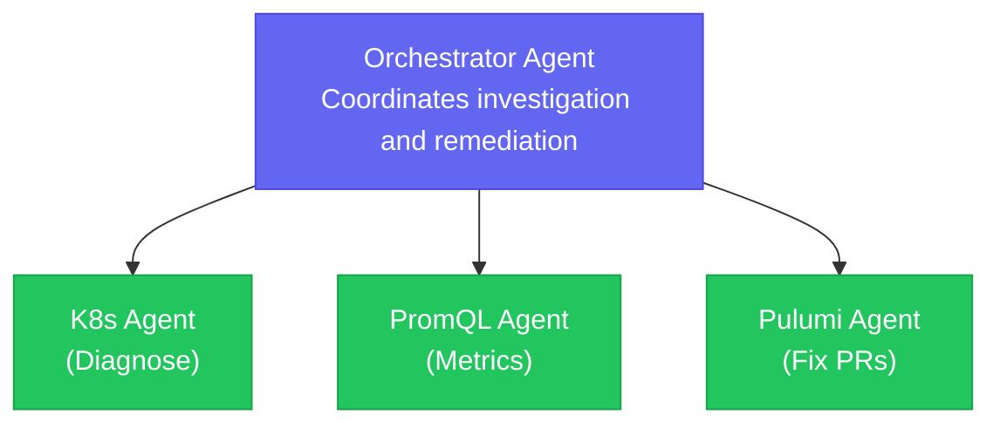

# Building AI-Assisted Operations: Agentic AI Workshop

[](https://slack.pulumi.com/)
[](https://codespaces.new/dirien/cfgmgmtcamp-2026-agentic-ai-workshop)

Welcome to the **Building AI-Assisted Operations: Agentic AI Workshop** repository! This hands-on workshop is part of
[CfgMgmtCamp Ghent 2026](https://cfgmgmtcamp.org/) and will guide you through constructing AI-assisted operational
workflows using Agents supported by MCPs (Model Context Protocols).

## Workshop Details

- **Event:** CfgMgmtCamp 2026 Ghent
- **Date:** February 4, 2026
- **Time:** 09:00–13:00
- **Location:** B.3.0.32

## What You'll Build

In this workshop, you'll create a multi-agent architecture using [Kagent](https://kagent.dev/) (a CNCF sandbox project) for automating DevOps investigations during deployment failures. Your AI systems will:

- **Diagnose** Kubernetes issues using a specialized K8s agent
- **Analyze** metrics and resource utilization with a PromQL agent
- **Fix** infrastructure code by creating pull requests via Pulumi Neo
- **Orchestrate** multiple agents that coordinate autonomously to investigate and resolve issues



## Speakers

| Name | Role | Company |
|------|------|---------|
| **Engin Diri** | Senior Solutions Architect | Pulumi |
| **Zaid Ajaj** | Software Engineer | Pulumi |

## Prerequisites

To participate in this workshop, you'll need:

- A laptop with internet access
- Basic understanding of Kubernetes and GitOps concepts
- A [GitHub account](https://github.com/signup) with a personal access token
- A [Pulumi account](https://app.pulumi.com/signup) (free tier is sufficient)
- Basic programming knowledge

## Workshop Content

| Chapter | Title | Duration |
|---------|-------|----------|
| [00](00-introduction.md) | Introduction | 10 min |
| [01](01-create-kubernetes-cluster.md) | Create Kubernetes Cluster | 30 min |
| [02](02-deploy-kagent-mcp.md) | Deploy Kagent & MCP | 45 min |
| [03](03-deploy-platform-workload.md) | Deploy Platform Workload | 30 min |
| [04](04-multi-agent-troubleshooting.md) | Multi-Agent Troubleshooting | 60 min |
| [05](05-housekeeping.md) | Cleanup | 15 min |

## Getting Started

### Using GitHub Codespaces (Recommended)

Click the button below to open this repository in GitHub Codespaces with all dependencies pre-configured:

[](https://codespaces.new/dirien/cfgmgmtcamp-2026-agentic-ai-workshop)

#### Codespace Requirements

The workshop devcontainer uses a large base image (`pulumi/pulumi`). To avoid build failures due to disk space limitations, please note:

| Machine Type | Disk Space | Recommendation |
|--------------|------------|----------------|
| 2-core | 32 GB | May fail during build |
| 4-core | 32 GB | Recommended minimum |
| 8-core | 64 GB | Best experience |
| 16-core | 128 GB | Overkill for this workshop |

**Free tier limits:** GitHub Free accounts include 120 core hours and 15 GB storage per month.

#### Codespace Troubleshooting

If your Codespace fails to build with a "no space left on device" error:

1. **Delete the failed Codespace** and create a new one with a larger machine type (4-core or higher)
2. **Check your storage usage** at https://github.com/settings/billing - old Codespaces consume storage quota
3. **Delete unused Codespaces** to free up storage allocation
4. **Use local development** as an alternative (see below)

### Local Development

1. Clone this repository:
   ```bash
   git clone https://github.com/dirien/cfgmgmtcamp-2026-agentic-ai-workshop.git
   cd cfgmgmtcamp-2026-agentic-ai-workshop
   ```

2. Follow the setup instructions in the first chapter.

## Troubleshooting

If you encounter any issues during the workshop:

1. Check that all prerequisites are installed correctly
2. Verify your GitHub token has the required permissions
3. Ensure your Pulumi account is properly configured
4. Ask for help! We're here to support you

## Want to Know More?

- [Pulumi Documentation](https://www.pulumi.com/docs/)
- [Pulumi AI & MCP](https://www.pulumi.com/docs/pulumi-cloud/ai/)
- [Kagent Documentation](https://kagent.dev/docs/)
- [Model Context Protocol](https://modelcontextprotocol.io/)
- [CfgMgmtCamp 2026](https://cfgmgmtcamp.org/)

Don't hesitate to reach out to us on the [Pulumi Community Slack](https://slack.pulumi.com/) if you have any questions!

## License

This project is licensed under the Mozilla Public License 2.0 - see the [LICENSE](LICENSE) file for details.
